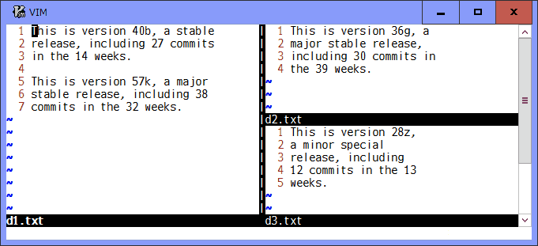

# blockwisediff.vim

## A block-oriented diff to compare selected lines virtually

### Introduction

Vim shows differences in diff mode. But it is a line-oriented comparison and
can not properly handle sentences and paragraphs which are broken into several
lines. This plugin virtually compares selected two block of lines as if there
were no line break and show their character or word level exact differences.
Note that this plugin works independently of the diff mode.

### Commands

* `:[range]BWDiffthis`
  * Select a block of lines with `[range]` (default: the current line) in
    the current window. Shortly after the two blocks have been selected,
    it compares them and shows their differences based on the `g:DiffUnit`
    option. You can use "icase", "iwhite", "iwhiteall" and "iwiteeol"
    flags in the `diffopt` option to ignore them. It is possible to select
    two blocks of lines in the same window.

* `:BWDiffoff[!]`
  * Clear the selected block in the current window and reset its
    differences. If `!` is specified, clear and reset all blocks in the
    current tab page.

* `:BWDiffupdate[!]`
  * Compare the selected blocks again and show their differences in the
    current tab page, when you make changes to the selected block or you
    want to to change `g:DiffUnit` or `g:DiffColors` option. If `!` is
    specified, try to additionally show the differences at line break
    positions.

### Options

* `g:DiffUnit`, `t:DiffUnit` - A type of difference unit
  * 'Char'   : any single character
  * 'Word1'  : \w\\+ word and any \W single character (default)
  * 'Word2'  : non-space and space words
  * 'Word3'  : \\< or \\> character class boundaries

* `g:DiffColors`, `t:DiffColors` - Matching colors for changed units (always `hl-DiffAdd` for added units)
  * 0   : always `hl-DiffText` (default)
  * 1   : 4 colors in fixed order
  * 2   : 8 colors in fixed order
  * 3   : 16 colors in fixed order

### Demo

